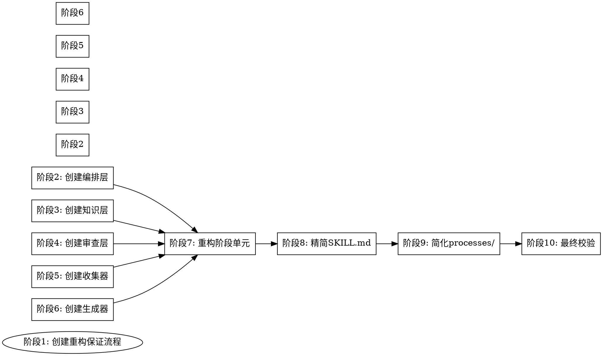

# Skill 重构设计方案可行性分析报告

## 一、分析背景

本报告对 `detailed-designs/` 和 `outlines/` 目录下的 Skill 重构设计方案进行可行性分析。

**分析文档**：
- Skill重构方案大纲.md（四层架构设计）
- 编排层详细设计.md
- 执行层详细设计.md
- 知识层详细设计.md
- 审查层详细设计.md

**参考标准**：
- superpowers 五种设计模式
- Writing Skills 规范
- Claude Skills 完整构建指南

---

## 二、设计亮点

### 2.1 架构分层清晰

四层架构（编排层、执行层、知识层、审查层）与五种设计模式对应良好：

| 层次 | 设计模式 | 职责 |
|------|----------|------|
| 编排层 | 流水线 | 流程调度、状态管理 |
| 执行层 | 生成器 + 反转 | 阶段执行、信息收集、内容生成 |
| 知识层 | 工具封装 | API规范、脚本定义、模板说明 |
| 审查层 | 审查器 | 禁止规则、配置校验、格式校验 |

### 2.2 职责分离合理

将 SKILL.md 从 187 行精简到 80 行，将知识、审查、执行逻辑分离到独立文件，符合递进式披露原则。

### 2.3 设计模式组合使用

设计中组合使用了多种模式：
- 流水线模式作为主流程框架
- 反转模式用于信息收集
- 生成器模式用于配置生成
- 审查器模式用于质量控制

---

## 三、核心问题分析

### 问题1："加载"与"读取"的语言混淆

**问题位置**：编排层设计、执行层设计

**具体表现**：

设计文档中多次使用"加载"一词：
```markdown
加载 [orchestrator.md](./orchestrator.md) 获取完整流程编排规则。
加载 [knowledge/env-knowledge.md](../knowledge/env-knowledge.md) 获取环境检测知识。
执行 [collectors/scene-collector.md](../collectors/scene-collector.md) 收集评测场景。
```

**问题分析**：

在 Claude Code 中，"加载" Skill 和"读取"文件是两个不同的概念：

| 操作 | 工具 | 效果 |
|------|------|------|
| 加载 Skill | Skill 工具 | Skill 内容被加载并作为指令执行 |
| 读取文件 | Read 工具 | 文件内容被读取作为参考资料 |

设计中的 orchestrator.md、collectors/scene-collector.md 等都不是独立的 Skill，无法通过 Skill 工具加载。Agent 只能通过 Read 工具读取它们。

**影响**：

1. Agent 可能误解指令意图，不知道应该使用哪个工具
2. 读取的文件内容作为参考资料，而非指令，执行力度较弱
3. 频繁读取文件会消耗大量 token

**建议**：

1. 明确区分"加载"和"读取"的使用场景
2. 对于必须严格遵循的指令，考虑直接内嵌在 Skill 文件中
3. 对于参考性质的知识，使用"读取"并提供清晰的触发条件

---

### 问题2：执行层文件调用的"返回点"模糊

**问题位置**：执行层设计 - collectors/

**具体表现**：

```markdown
## 返回点
收集完成后返回构建配置阶段步骤2。
```

**问题分析**：

1. **"收集完成"的定义不明确**：Agent 如何判断收集完成？是获取到所有必需信息？还是用户确认？

2. **"返回"的实现方式不明确**：Agent 如何"返回"到某个阶段？是通过重新读取阶段文件？还是继续执行之前暂停的流程？

3. **状态管理缺失**：Agent 在执行收集器时，如何记住"当前在构建配置阶段步骤2"？这个状态存储在哪里？

**影响**：

Agent 可能：
- 在收集完成后不知道接下来做什么
- 重复执行已经完成的步骤
- 丢失执行上下文

**建议**：

1. 使用 TodoWrite 工具明确记录当前执行状态
2. 定义清晰的"完成条件"，而非模糊的"收集完成"
3. 考虑将收集器逻辑内嵌到阶段文件中，避免频繁的文件切换

---

### 问题3："自动推断"机制过于依赖 Agent 猜测

**问题位置**：执行层设计 - collectors/scene-collector.md

**具体表现**：

```markdown
### 自动推断（优先）
检查历史对话中是否有场景信息：

| 信息类型 | 识别关键词 | 推断结果 |
|----------|------------|----------|
| 场景名称 | "知识问答"、"内容创造"、... | 直接使用 |
| 场景描述 | "评测模型的知识问答能力"、... | 匹配专家模板 |
```

**问题分析**：

1. **历史对话范围不明确**：是指当前会话？还是之前所有的会话？

2. **关键词匹配规则不精确**：如果用户说"我想评测模型的知识问答和内容创造能力"，应该匹配哪个场景？

3. **推断失败的处理不明确**：如果无法确定场景，Agent 应该直接询问还是选择默认值？

**影响**：

- Agent 可能错误推断场景
- Agent 可能反复检查历史对话浪费 token
- 用户可能被强制接受错误的推断

**建议**：

1. 定义明确的推断优先级和规则
2. 对于模糊输入，优先询问而非推断
3. 提供"推断置信度"机制，低于阈值时主动询问

---

### 问题4：knowledge/ 和 references/ 的内容重复问题

**问题位置**：知识层设计

**具体表现**：

```markdown
### 与 references/ 的关系
| 对比项 | references/ | knowledge/ |
|--------|-------------|------------|
| 内容 | 完整详细文档 | 精简快速参考 |
| 加载时机 | 按需加载 | 高频按需加载 |
```

**问题分析**：

1. **内容重复**：同一个知识内容需要维护两份，增加维护成本

2. **一致性风险**：如果 API 变更，需要同时更新两个目录下的文件，容易遗漏

3. **加载选择困惑**：Agent 在什么时候应该加载 references/，什么时候加载 knowledge/？

**影响**：

- 维护成本增加
- 可能出现版本不一致
- Agent 可能选择错误的文件加载

**建议**：

1. 考虑只保留一份知识文件，通过文档结构实现"精简"和"详细"的区分
2. 或者：knowledge/ 文件只包含"快速参考"，明确引用 references/ 作为完整文档
3. 添加版本一致性检查机制

---

### 问题5："按需加载"的自我参照悖论

**问题位置**：知识层设计 - knowledge/

**具体表现**：

```markdown
| 知识文件 | 加载时机 | 触发条件 |
|----------|----------|----------|
| api-knowledge.md | 调用 API 时 | 需要查看接口规范 |
| script-knowledge.md | 执行脚本时 | 需要查看命令参数 |
```

**问题分析**：

这是一个**自我参照悖论**：

- Agent 需要判断"是否需要查看接口规范"
- 但如果 Agent 已经知道要调用哪个 API，它可能认为自己不需要查看规范
- 如果 Agent 不知道要调用哪个 API，它需要先查看规范才能知道

**影响**：

- Agent 可能跳过必要的知识加载
- 或者在不必要的时候加载知识浪费 token

**建议**：

1. 将知识加载指令改为**强制性**，而非"按需判断"
2. 在阶段文件中明确指定"在此步骤加载 XXX 知识"
3. 使用"加载检查清单"确保知识正确加载

---

### 问题6：red-flags.md 的"每次行动前审查"不现实

**问题位置**：审查层设计 - validators/red-flags.md

**具体表现**：

```markdown
| 文件 | 职责 | 审查时机 |
|------|------|----------|
| red-flags.md | 禁止规则清单 | 每次行动前 |
```

**问题分析**：

1. **Token 消耗过大**：每次行动都读取 red-flags.md 会消耗大量 token

2. **执行效率低下**：频繁读取文件会影响响应速度

3. **实际不可行**：Agent 无法真正做到"每次行动前审查"，因为 Agent 的"行动"是一个连续的过程

**对比 superpowers 设计**：

在 superpowers 的设计中，Red Flags 是**内嵌**在 Skill 内容中的：
```markdown
## Red Flags - STOP
- 跳过分析直接开始重构
- "我已经知道要改哪些文件"
```

Agent 在加载 Skill 时就已经看到了 Red Flags，不需要额外读取。

**建议**：

1. 将核心 Red Flags 内嵌到 SKILL.md 或相关阶段文件中
2. 只将"扩展规则"放在 validators/red-flags.md
3. 在关键步骤前添加明确的"停止检查点"

---

### 问题7：门控条件的自我参照悖论

**问题位置**：重构保障设计 - 门控条件

**具体表现**：

```json
{
  "completeness_check": {
    "all_files_identified": true,
    "all_deps_traced": true,
    "all_risks_assessed": true
  }
}
```

**问题分析**：

Agent 如何知道自己"遗漏了文件"？

- 门控条件要求 Agent 确认"所有文件已识别"
- 但如果 Agent 不知道某个文件存在，它不会知道自己遗漏了
- 门控变成了形式主义的"打勾"而非真正的验证

**影响**：

- Agent 可能盲目地将门控条件标记为 true
- 真正的遗漏无法被发现

**建议**：

1. 门控条件应该是**可机械化验证**的命令
2. 使用具体数量或明确的存在性检查
3. 引入外部验证机制（如测试命令、子代理审查）

**改进示例**：

```markdown
# 不好的门控
- all_files_identified: true

# 好的门控
- 执行 `git diff --name-only HEAD~5` 获取变更文件列表
- 执行 `grep -r "\[.*\]\(" --include="*.md" | grep -v "node_modules"` 验证引用完整性
- 对比两个列表，确认无遗漏
```

---

### 问题8：中间产物（JSON 文件）的一致性问题

**问题位置**：重构保障设计 - 中间产物

**具体表现**：

设计中有五个 JSON 产物：
- scope.json
- design.json
- review.json
- changes.json
- validation.json

**问题分析**：

1. **格式验证缺失**：Agent 生成的 JSON 可能有语法错误，设计中没有"JSON 格式验证"步骤

2. **一致性维护**：五个 JSON 文件之间有引用关系（design.json 引用 scope.json 的 analysis_id）。如果 scope.json 更新，后续文件是否需要更新？

3. **可追溯性缺失**：JSON 文件没有版本控制建议，无法回溯"为什么做出这个决定"

**影响**：

- JSON 格式错误可能导致后续步骤失败
- 文件间不一致可能导致执行错误
- 缺乏历史记录影响问题排查

**建议**：

1. 添加 JSON 格式验证步骤
2. 定义文件间的依赖关系和更新规则
3. 考虑使用 git commit 作为每个阶段的检查点

---

### 问题9：实施阶段缺少依赖关系图

**问题位置**：实施详细步骤

**具体表现**：

设计中说阶段有依赖关系，但没有可视化依赖关系。

**问题分析**：

1. **并行执行不明确**：阶段 3（知识层）和阶段 4（审查层）是否可以并行？

2. **回滚粒度不明确**：如果阶段 4 失败，是否需要回滚阶段 3？

3. **关键路径不清晰**：哪些阶段是关键路径？哪些可以延迟执行？

**建议**：

添加依赖关系图：



---

## 四、设计模式符合度分析

### 4.1 与五种设计模式的对比

| 设计模式 | 设计中的使用 | 符合度 | 问题 |
|----------|--------------|--------|------|
| **工具封装** | knowledge/ 目录 | ⚠️ 部分 | 加载机制模糊 |
| **生成器** | generators/ 目录 | ✅ 良好 | 需要明确触发条件 |
| **审查器** | validators/ 目录 | ⚠️ 部分 | 独立成层可能导致割裂 |
| **反转** | collectors/ 目录 | ⚠️ 部分 | 自动推断依赖猜测 |
| **流水线** | orchestrator.md | ✅ 良好 | 状态管理需要明确 |

### 4.2 与 Writing Skills 规范的对比

| 规范要求 | 设计中的表现 | 符合度 |
|----------|--------------|--------|
| **递进式披露** | SKILL.md 精简到 80 行 | ✅ 符合 |
| **可组合性** | 各层独立可组合 | ✅ 符合 |
| **可移植性** | 设计中未明确 | ⚠️ 待补充 |
| **Description = 触发条件** | SKILL.md description 设计合理 | ✅ 符合 |
| **SKILL.md < 500 行** | 目标 80 行 | ✅ 符合 |

---

## 五、改进建议总结

### 5.1 高优先级改进

| 问题 | 改进建议 | 预期效果 |
|------|----------|----------|
| **语言混淆** | 明确区分"加载"和"读取"，或直接内嵌指令 | 避免 Agent 误解 |
| **返回点模糊** | 使用 TodoWrite 记录状态，定义明确完成条件 | 避免执行混乱 |
| **自动推断依赖猜测** | 定义明确的推断规则和优先级，低置信度时询问 | 减少错误推断 |
| **门控自我参照** | 使用可机械化验证的命令替代主观判断 | 确保真正验证 |
| **每次行动前审查** | 将核心 Red Flags 内嵌到 Skill 文件中 | 减少文件读取 |

### 5.2 中优先级改进

| 问题 | 改进建议 | 预期效果 |
|------|----------|----------|
| **knowledge/ 和 references/ 重复** | 合并为单份文件或明确定义引用关系 | 减少维护成本 |
| **按需加载悖论** | 改为强制性加载，在阶段文件中明确指定 | 确保知识正确加载 |
| **JSON 一致性** | 添加格式验证和依赖关系定义 | 避免格式错误 |

### 5.3 低优先级改进

| 问题 | 改进建议 | 预期效果 |
|------|----------|----------|
| **依赖关系图缺失** | 添加 DOT 格式的依赖图 | 明确并行和回滚 |

---

## 六、可行性评估

### 6.1 总体评估

| 评估维度 | 评分 | 说明 |
|----------|:----:|------|
| **架构设计** | 7/10 | 四层架构合理，但审查层独立性存疑 |
| **执行可行性** | 5/10 | 文件调用机制、状态管理需要完善 |
| **指令清晰度** | 6/10 | 语言混淆、模糊指令需要修正 |
| **可维护性** | 6/10 | 内容重复、一致性问题需要解决 |
| **与规范符合度** | 7/10 | 基本符合，细节需要完善 |
| **综合评分** | **6.2/10** | 设计方向正确，细节需要完善 |

### 6.2 结论

设计方案的**方向正确**，四层架构和职责分离的设计思路合理。但在**执行层面**存在多个需要完善的问题：

1. **语言层面**：需要明确区分"加载"和"读取"的使用场景
2. **流程层面**：需要完善状态管理和完成条件定义
3. **判断层面**：需要减少对 Agent "猜测"的依赖，提供明确的规则
4. **验证层面**：需要使用可机械化验证的命令替代主观判断

### 6.3 建议

1. **短期**：修正语言混淆、完善状态管理、添加明确的判断规则
2. **中期**：合并重复内容、添加 JSON 验证机制
3. **长期**：考虑与 superpowers 框架集成，使用子代理审查机制

---

## 附录：设计改进检查清单

- [ ] 明确区分"加载"和"读取"的使用场景
- [ ] 使用 TodoWrite 记录执行状态
- [ ] 定义收集器的明确完成条件
- [ ] 提供推断规则的优先级和置信度机制
- [ ] 将核心 Red Flags 内嵌到 Skill 文件
- [ ] 使用可机械化验证的门控条件
- [ ] 添加 JSON 格式验证步骤
- [ ] 定义 JSON 文件间的依赖关系
- [ ] 添加实施阶段依赖关系图
- [ ] 考虑合并 knowledge/ 和 references/ 内容