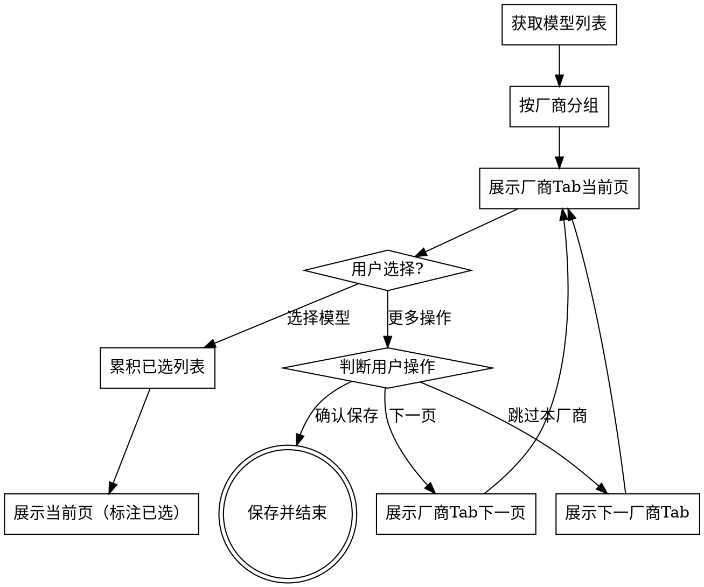

# 模型选择流程交互改进设计

## 背景

### 问题分析

当前 `evalset-model-selection.md` 文档描述的交互方式与实际执行工具能力不匹配：

| 文档描述 | 实际工具能力 |
|----------|--------------|
| 用户输入序号选择模型 | AskUserQuestion 仅支持点击选择 |
| 用户输入"其他"切换Tab | AskUserQuestion 无文本输入功能 |
| 用户输入"确认"结束流程 | 需要在选项中预设结束操作 |

这导致：
1. AI 执行时无法按文档描述进行多轮文本交互
2. AskUserQuestion 最多4选项限制，无法展示完整模型列表
3. 用户无法看到分类展示的完整信息

### 用户需求

通过 brainstorming 收集的需求：

| 需求项 | 用户选择 |
|--------|----------|
| 交互方式 | 分批多轮选择 |
| 分批逻辑 | 按厂商分组展示 |
| 结束机制 | 用户主动确认结束 |
| 选项超限处理 | 厂商内分页 |

---

## 设计方案

### 方案概述

采用 **纯 AskUserQuestion 分页交互** 方案：

- 按厂商分组，每次展示一个厂商的模型
- 每页最多3个模型选项 + 1个"更多操作"选项
- 用户选择模型后累积到已选列表，继续展示当前页
- 用户点击"更多操作"可选择：下一页/跳过本厂商/确认保存
- 用户点击"确认保存"结束流程

### 交互流程



---

## 详细设计

### AskUserQuestion 选项构成

每页展示 **最多4个选项**：

| 位置 | 类型 | 格式示例 |
|------|------|----------|
| 选项1-3 | 模型选项 | `DeepSeek-V3.1 (xdeepseekv31)` 或 `DeepSeek-V3.1 (xdeepseekv31) [已选]` |
| 选项4 | 操作选项 | `更多操作` |

点击"更多操作"后展开：

| 选项 | 说明 |
|------|------|
| `下一页` | 查看当前厂商更多模型 |
| `跳过本厂商` | 进入下一厂商第1页 |
| `确认保存` | 结束选择并保存已选列表 |

### 已选状态展示

| 场景 | 展示方式 |
|------|----------|
| 当前页有已选模型 | 选项后标注 `[已选]` |
| AskUserQuestion标题 | 已选时显示 `选择 {厂商名} 系列模型（已选{n}个）` |

### 厂商分组规则

从 `available-models.json` 中按模型 `name` 或 `model` 字段识别厂商：

| 厂商 | 识别关键词 |
|------|------------|
| DeepSeek | `deepseek` |
| Qwen | `qwen`, `op3` |
| 讯飞星火 | `spark`, `星火` |
| 测试模型 | `test` 或其他未匹配 |

---

## 文档修改内容

### 修改文件

`processes/evalset-model-selection.md` 步骤2部分

### 修改前（原文）

```markdown
## 步骤2：用户分类选择模型

⚠️ **此步骤需要用户交互确认**：用户需浏览模型列表、选择模型、确认后才能保存。

| 状态 | 动作 |
|------|------|
| 用户输入序号 | → 追加到已选列表，继续展示当前Tab |
| 用户输入"其他" | → 切换到下一厂商Tab |
| 用户输入"确认" | → 进入步骤3保存 |

**交互规则**：

| 规则 | 说明 |
|------|------|
| 分组依据 | 按厂商分类展示（DeepSeek、讯飞星火、OpenAI等） |
| 序号规则 | 全局连续编号（Tab1: 1-5，Tab2: 6-10） |
| 累积规则 | 跨Tab选择累积保存，模型ID不同不视为重复 |
| 展示状态 | 已选模型在当前Tab内标注"[已选]" |
| 展示格式 | `序号. {name} ({model}) - {description}` 或 `序号. {name} ({model}) [已选] - {description}` |

**交互流程**：

1. 读取 `available-models.json`，按厂商分组
2. 展示第一个厂商Tab，显示已选列表（初始为空）
3. 用户输入序号选择、输入"其他"切换Tab、输入"确认"结束
4. 确认后进入步骤3保存
```

### 修改后（新设计）

```markdown
## 步骤2：用户分类选择模型

⚠️ **此步骤需要用户交互确认**：用户需浏览模型列表、选择模型、确认后才能保存。

### 步骤2.1：按厂商分组

读取 `available-models.json`，按厂商分组（DeepSeek、Qwen、讯飞星火、测试模型等）。

识别规则：按模型 `name` 或 `model` 字段关键词识别厂商。

### 步骤2.2：分页展示与累积选择

使用 AskUserQuestion 工具分页展示，每页最多3个模型选项 + 1个"更多操作"选项。

**选项构成**：

| 位置 | 类型 | 格式 |
|------|------|------|
| 选项1-3 | 模型 | `{name} ({model})`，已选模型标注 `[已选]` |
| 选项4 | 操作 | `更多操作` |

**"更多操作"展开选项**：

| 选项 | 说明 |
|------|------|
| `下一页` | 查看当前厂商更多模型 |
| `跳过本厂商` | 进入下一厂商第1页 |
| `确认保存` | 结束选择并保存 |

**交互规则**：

| 规则 | 说明 |
|------|------|
| 分组依据 | 按厂商分类展示（DeepSeek、Qwen、讯飞星火等） |
| 分页规则 | 每页3个模型 + 1个"更多操作"选项 |
| 累积规则 | 用户选择模型后累积到已选列表，已选模型标注 `[已选]` |
| 页内循环 | 选择模型后继续展示当前页（标注已选状态） |
| 厂商切换 | 点击"跳过本厂商"进入下一厂商第1页 |
| 结束条件 | 点击"确认保存"结束流程，进入步骤3保存 |

**AskUserQuestion 标题格式**：
- 未选时：`选择 {厂商名} 系列模型`
- 已选时：`选择 {厂商名} 系列模型（已选{n}个）`

### 步骤2.3：保存已选列表

用户点击"确认保存"后，调用脚本保存：

```bash
{python-env}{python-cmd} {skill-dir}/scripts/eval_model.py select-models \
  --input {work-dir}/.eval/{session-id}/available-models.json \
  --selection "{已选模型model字段值，逗号分隔}" \
  --output {work-dir}/.eval/{session-id}/selected-models.json
```

**示例**：已选 DeepSeek-V3.1 和 Qwen3-235B，`--selection` 参数为 `xdeepseekv31,xop3qwen235b`。
```

---

## 红线更新

在文档红线部分补充：

| 错误 | 原因 | 解决方案 |
|------|------|----------|
| 单页展示超过3个模型 | AskUserQuestion 选项限制 | 严格执行每页3模型 + 1操作选项 |
| 用户选择模型后直接进入下一页 | 未实现页内循环 | 选择模型后继续展示当前页 |
| 未标注已选状态 | 用户无法看到选择结果 | 已选模型必须标注 `[已选]` |

---

## 验证清单

| 检查项 | 验证方式 |
|--------|----------|
| 厂商分组正确 | 读取 `available-models.json`，验证分组逻辑 |
| 分页展示正确 | 模拟交互，验证每页选项构成 |
| 已选状态标注正确 | 选择模型后验证 `[已选]` 标注 |
| 累积选择正确 | 跨厂商选择后验证已选列表 |
| 保存正确 | 验证 `selected-models.json` 内容 |

---

## 影响范围

| 文件 | 修改类型 |
|------|----------|
| `processes/evalset-model-selection.md` | 步骤2重写 |
| `SKILL.md` | 无需修改（交互规范已覆盖） |
| `scripts/eval_model.py` | 无需修改（select-models 子命令已支持逗号分隔） |